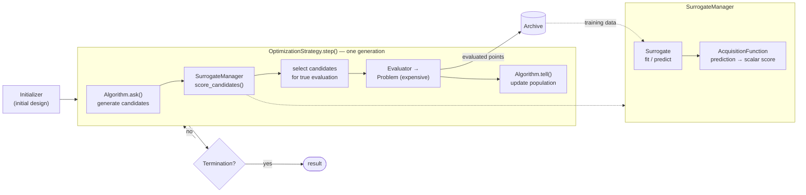

<div align="center">

<picture>
  <source media="(prefers-color-scheme: dark)" srcset="docs/_static/logo-dark.svg">
  
</picture>


[](https://codecov.io/gh/shlka/saealib)


[](LICENSE)
[](https://pepy.tech/project/saealib)

[](https://github.com/astral-sh/uv)


[](https://numpy.org/)

</div>

**Status: Active Development (Beta)**
> **Warning**: This project is under active development. APIs are subject to change without notice. Operation is not guaranteed in production environments.

A comprehensive library for **Surrogate-Assisted Evolutionary Algorithms (SAEAs)** in Python.  
Designed for expensive optimization problems where function evaluations are costly, `saealib` provides a modular framework to combine evolutionary algorithms, surrogate models, and model management strategies.

## Table of Contents

- [Why saealib](#why-saealib)
- [Documents](#documents)
- [Key Features](#key-features)
- [Installation](#installation)
- [Quick Start](#quick-start)
- [Architecture Overview](#architecture-overview)
- [Contributing](#contributing)
- [License](#license)

## Why saealib

Python's evolutionary-optimization landscape has [pymoo](https://github.com/anyoptimization/pymoo) for
population-based multi-objective search, and expensive/surrogate-assisted optimization split off into its
now-dormant sister project [pysamoo](https://github.com/anyoptimization/pysamoo). Neither treats *which
candidates get an expensive true evaluation* as something you can swap: it's implemented once per
algorithm, not as a reusable component.

`saealib` makes that decision — the `OptimizationStrategy` (individual-based / generation-based /
pre-selection / direct) — a first-class, swappable component, alongside a decoupled `Surrogate` /
`AcquisitionFunction` / `SurrogateManager` split and a typed callback system (`PostCrossoverEvent`,
`PostMutationEvent`, `PostAskEvent`, ...) for observing pipeline state and swapping components mid-run.

| | saealib | pymoo | pysamoo |
|---|---|---|---|
| Model-management strategy as a swappable component | Yes | No (always evaluates all candidates) | Hardcoded per algorithm class |
| Mid-run component swap via typed pipeline events | Yes | "not to customize an algorithm" ([docs](https://pymoo.org/interface/callback.html)) | No |
| Surrogate / acquisition-function decoupling | Yes | No (delegated to pysamoo) | Partial |
| Maintenance |  |  |  |
| License | Apache-2.0 | Apache-2.0 | AGPL-3.0 |

To be upfront about the trade-off: `saealib` currently ships fewer named algorithms (GA, PSO) than
general-purpose libraries like pymoo or PlatEMO, since its focus is the surrogate/strategy layer rather
than algorithm breadth. See [the documentation](https://shlka.github.io/saealib/index.html) for the full
picture.

## Documents
[shlka.github.io/saealib](https://shlka.github.io/saealib/index.html)

## Key Features

- **Modular Architecture**: every concept (Algorithm, Surrogate, Strategy, Acquisition function) has an abstract
  base and can be swapped at construction time via `Optimizer.set_*()`, chained fluently.
- **Algorithms**: GA and PSO, with a full operator library (SBX/BLX-Alpha/uniform/one/two-point crossover,
  polynomial/Gaussian/uniform mutation, tournament/roulette-wheel/sequential/truncation selection, plus
  categorical/integer variants for mixed-variable problems).
- **Multi-objective ready**: NSGA-II/III and R-NSGA-II comparators, Pareto/epsilon-dominance ranking,
  hypervolume indicators, and decomposition-based comparators (Tchebycheff/PBI/weighted-sum) for
  MOEA/D-style setups.
- **Surrogate models**: built-in RBF, plus optional adapters for scikit-learn (Gaussian Process, Random
  Forest, SVM, MLP), XGBoost, LightGBM, and PyTorch — including classification surrogates for feasibility
  prediction and pairwise-comparison surrogates.
- **Strategies**: generation-based, individual-based, pre-selection, and direct (no-surrogate) management,
  each deciding independently which candidates receive true (expensive) evaluation.
- **Constraint handling**: equality/inequality constraints, epsilon-constraint tolerance scheduling, and
  gradient-based repair.
- **Fine-grained injection**: `CallbackManager` exposes pipeline events (pre/post crossover, mutation, ask,
  surrogate fit, evaluation, generation/run boundaries) for observing pipeline state and swapping
  components mid-run without subclassing.

## Installation

### Requirements
- Python >= 3.10

```bash
pip install saealib
# or
uv add saealib
```

saealib is still pre-1.0 (only pre-releases published so far); once a stable release ships,
pre-releases will require `pip install --pre saealib`.

### Optional extras

| Extra | Adds |
|---|---|
| `sklearn` | scikit-learn-based surrogates |
| `xgboost` | XGBoost surrogate |
| `lightgbm` | LightGBM surrogate |
| `torch` | PyTorch-based components |
| `parallel` | joblib-based parallel evaluation |
| `all` | everything above |

```bash
pip install "saealib[sklearn,parallel]"
# or install everything
pip install "saealib[all]"
```

### Install from source

For contributing or a development setup, see [CONTRIBUTING.md](CONTRIBUTING.md).

## Quick Start

`minimize()` / `maximize()` run a surrogate-assisted optimization end-to-end with sensible defaults
(GA algorithm, RBF surrogate, individual-based strategy):

```python
import numpy as np
from saealib import minimize

def sphere(x):
    return np.sum(x**2)

result = minimize(
    sphere,
    dim=5,
    lb=[-5.0] * 5,
    ub=[5.0] * 5,
    max_fe=500,
    seed=0,
)

print(result.x, result.f)
```

Every default is overridable — pass `algorithm='PSO'`, `surrogate='rbf'`, `strategy='gb'`/`'ps'`, or
your own component instances (`Algorithm`, `Surrogate`/`SurrogateManager`, `OptimizationStrategy`).

For per-generation inspection, custom pipelines, or research-style control loops, build an `Optimizer`
directly and drive it with `.iterate()` instead of `.run()`. See
[the documentation](https://shlka.github.io/saealib/index.html) for the low-level API and full component
reference.

## Architecture Overview

An `Optimizer` assembles the components below and drives a generation loop until `Termination`.
Each generation is orchestrated by the `OptimizationStrategy`: the `Algorithm` proposes candidates
(ask), the `SurrogateManager` scores them cheaply, the strategy decides which of them receive a
true (expensive) evaluation, and the results flow back into the population (tell) and the
`Archive` — which in turn is the surrogate's training data:



Every stage dispatches typed events through the `CallbackManager`, so pipeline data can be
observed or altered at any point without subclassing (see [Key Features](#key-features)).

<details>
<summary>Component descriptions</summary>

- **Problem**: Defines the objective function, constraints, bounds, and optimization direction.
- **Initializer**: Samples the initial archive and population before the loop starts.
- **Algorithm**: The evolutionary search engine (GA, PSO); `ask()` generates candidates,
  `tell()` updates the population.
- **OptimizationStrategy**: Owns the generation pipeline and decides which candidates get a true
  evaluation (individual-based, generation-based, pre-selection, or direct).
- **SurrogateManager**: Coordinates surrogate fitting and scoring; exposes `score_candidates()`.
  - **Surrogate**: Fits a model on archive data and predicts — knows nothing about scoring.
  - **AcquisitionFunction**: Converts predictions into scalar scores (higher = better) — knows
    nothing about the model.
- **Evaluator**: Executes true evaluations (serially, or in parallel via the `parallel` extra).
- **Archive**: Stores every truly evaluated point; doubles as the surrogate's training set.
- **Termination**: Stops the loop (max function evaluations by default).

</details>

## Contributing

Contributions are welcome! Please refer to [CONTRIBUTING.md](CONTRIBUTING.md) for guidelines on how to contribute to this project.

## License

[Apache License 2.0](LICENSE)
